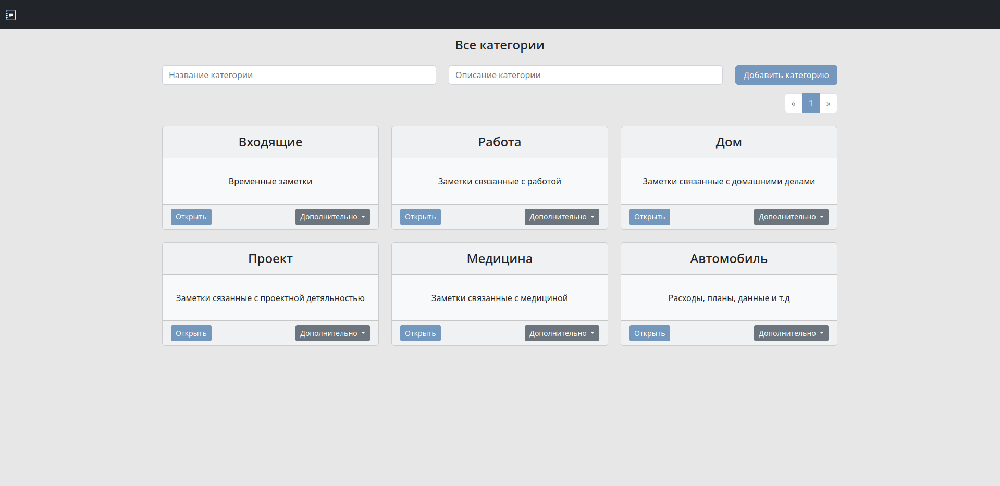
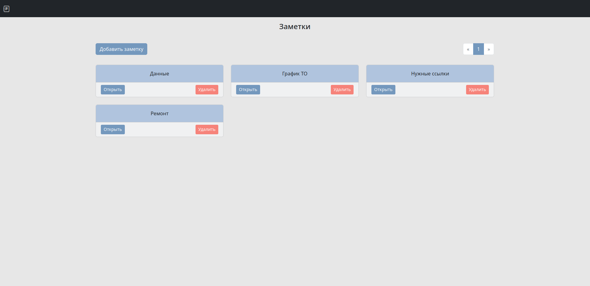
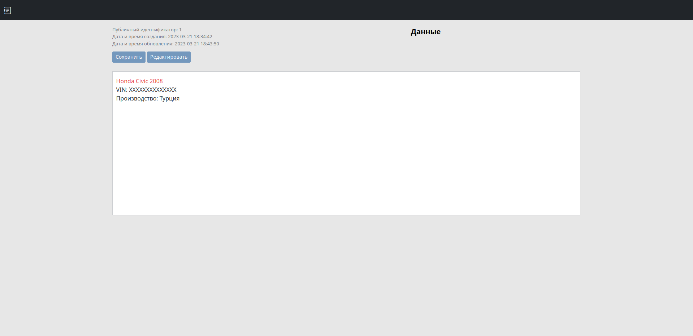
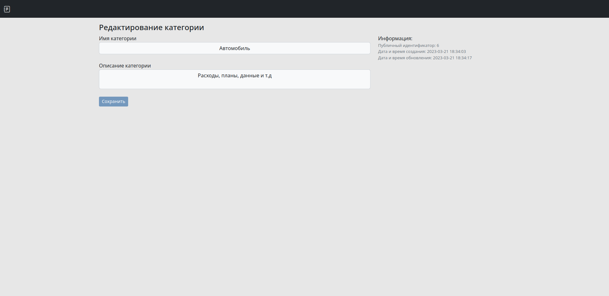
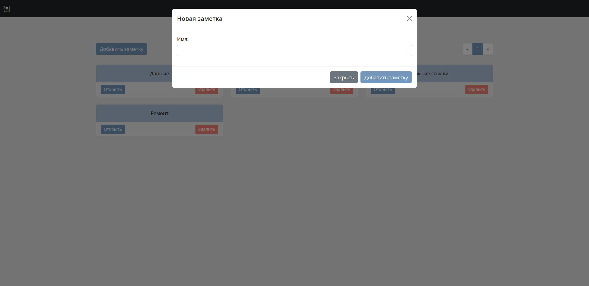
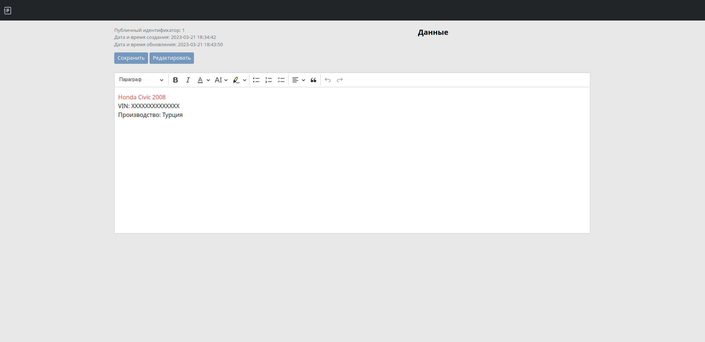

# Проект "Заметки"

## Описание

Веб-приложение для хранения заметок

## Скриншоты

#### Главный экран (Категории)



#### Заметки выбранной категории



#### Просмотр заметки



<details>
<summary>Дополнительные скриншоты</summary>

#### Экран редактирования категории



#### Экран добавления заметки



#### Экран редактирования заметки



</details>

## Запуск

```shell
docker-compose --project-name notes --file docker-compose.yaml up
```

## Технологии

- Kotlin
- Spring Boot
- Spring Data (PostgreSQL, Liquibase)
- Docker
- Thymeleaf
- JavaScript
- Axios
- CKEditor 5
- Bootstrap 5